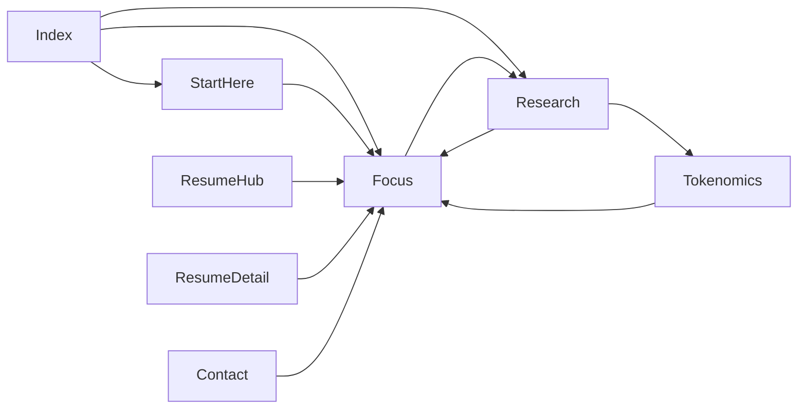

# Institutional Restoration Plan

## Goal

Keep the cleaner current site structure, but restore the thesis, proof, methodology, and trust signals that made the earlier live site feel like a differentiated institutional research platform.

## Guardrails

- Treat [content/copy.md](/Users/zach/.cursor/worktrees/CryptoZach/bht/content/copy.md) as the source of truth for restored copy. Extend it before or at the same time as HTML updates so new copy does not drift.
- Preserve the current multi-page IA across [index.html](/Users/zach/.cursor/worktrees/CryptoZach/bht/index.html), [start-here.html](/Users/zach/.cursor/worktrees/CryptoZach/bht/start-here.html), [selected-research.html](/Users/zach/.cursor/worktrees/CryptoZach/bht/selected-research.html), [tokenomics-research.html](/Users/zach/.cursor/worktrees/CryptoZach/bht/tokenomics-research.html), [resume.html](/Users/zach/.cursor/worktrees/CryptoZach/bht/resume.html), [contact.html](/Users/zach/.cursor/worktrees/CryptoZach/bht/contact.html), and the three role-specific resume pages.
- Reuse the existing design system in [styles.css](/Users/zach/.cursor/worktrees/CryptoZach/bht/styles.css) wherever possible. New CSS should be minimal, reusable, and actually consumed by markup.
- Do not reintroduce dead CSS or JS. [script.js](/Users/zach/.cursor/worktrees/CryptoZach/bht/script.js) should stay unchanged unless nav changes require a menu or active-state fix.
- Keep the homepage concise. Dense methodology belongs on the new [focus.html](/Users/zach/.cursor/worktrees/CryptoZach/bht/focus.html), not back on the homepage.

## Desired Site Flow

## Files In Scope

- [content/copy.md](/Users/zach/.cursor/worktrees/CryptoZach/bht/content/copy.md)
- [styles.css](/Users/zach/.cursor/worktrees/CryptoZach/bht/styles.css)
- [index.html](/Users/zach/.cursor/worktrees/CryptoZach/bht/index.html)
- [focus.html](/Users/zach/.cursor/worktrees/CryptoZach/bht/focus.html) (new)
- [start-here.html](/Users/zach/.cursor/worktrees/CryptoZach/bht/start-here.html)
- [selected-research.html](/Users/zach/.cursor/worktrees/CryptoZach/bht/selected-research.html)
- [tokenomics-research.html](/Users/zach/.cursor/worktrees/CryptoZach/bht/tokenomics-research.html)
- [resume.html](/Users/zach/.cursor/worktrees/CryptoZach/bht/resume.html)
- [contact.html](/Users/zach/.cursor/worktrees/CryptoZach/bht/contact.html)
- [resume/policy-market-infrastructure.html](/Users/zach/.cursor/worktrees/CryptoZach/bht/resume/policy-market-infrastructure.html)
- [resume/asset-management-tokenization.html](/Users/zach/.cursor/worktrees/CryptoZach/bht/resume/asset-management-tokenization.html)
- [resume/stablecoin-payments-strategy.html](/Users/zach/.cursor/worktrees/CryptoZach/bht/resume/stablecoin-payments-strategy.html)

## Phase 1: Canonical Copy And Navigation Decision

Update [content/copy.md](/Users/zach/.cursor/worktrees/CryptoZach/bht/content/copy.md) with canonical blocks for:

- Homepage thesis strip
- Homepage proof strip
- Homepage research-process strip
- Homepage `What I build` cards
- Focus page hero, framework summaries, process bullets, and CTA copy
- Updated resume hub intro and closing
- Updated contact hero/body copy
- Shared footer tagline

Decide nav before editing page chrome:

- Preferred: remove `Home` from desktop, mobile, and footer navs, and rely on the brand link for home.
- Fallback: keep `Home` and insert `Focus` after `Start Here` if the header feels crowded or if active-state clarity degrades.

## Phase 2: Homepage Restoration In [index.html](/Users/zach/.cursor/worktrees/CryptoZach/bht/index.html)

Use existing structure in `section.hero`, `div.hero-actions`, `div.meta`, `section#what-i-do`, and `section#writing`.

### Hero trust and CTA layer

- Replace the current hero CTA pair inside `div.hero-actions` with:
  - Primary: `Get in touch`
  - Secondary: `Start here`
- Add a helper line below the CTA row:
  - `Hiring or evaluating fit? View resume.`
- Add a third badge inside `div.meta`:
  - `Independent research | Non-advocacy`
- Insert a thesis strip immediately after `section.hero` and before `section.start-here-teaser`:
  - `Unifying thesis: regulate and audit the operator and the router, not the token.`
- Insert a proof strip directly below the thesis strip:
  - `Built the research function at Borderless Capital. Led a four-analyst team. Supported diligence across ~250 investments and ~500M in assets under management. Advised on 100+ tokenization engagements.`

### Replace the current service block with stronger institutional outputs

Replace `section#what-i-do` with `What I build` using four cards:

- `Scenario architecture`: `Priority-ranked decision trees, stress paths, and named thresholds for what changes the view.`
- `Diligence frameworks`: `Evidence gates for tokenized products, with pass-fail criteria for custody, settlement, disclosure, and whether the tokenized version really works like the traditional asset.`
- `Turning rules into product decisions`: `Plain-language translation of legislation and market structure into the interfaces, operators, and workflows that actually carry risk.`
- `Decision memos and escalation plans`: `Recommendations clear enough for a decision memo, monitoring thresholds, and clear triggers to move forward, redesign, or stop.`

### Add a research-process strip

Insert a compact section between `section#what-i-do` and `section#writing`:

- Heading: `How the research is run`
- `Evidence first`: `Every major claim ties to a mechanism, dataset, or stress scenario.`
- `Thresholds tied to action`: `Metrics stay only if they change a decision, owner, or escalation path.`
- `Published on readiness`: `Work is released when the evidence is ready, not to fill a calendar.`

### Improve research framing

In `section#writing`:

- Replace the current intro with:
  - `Eight papers across two tracks: stablecoin and dollar infrastructure, and tokenomics and DePIN. These three are the best starting points.`
- Add a Track B bridge below `div.writing-cta-row`:
  - `Looking for the second track? Explore tokenomics and DePIN.`

## Phase 3: Minimal CSS In [styles.css](/Users/zach/.cursor/worktrees/CryptoZach/bht/styles.css)

Add only the small reusable patterns the restored content needs. Preferred class inventory:

- `.hero-helper`
- `.thesis-strip`
- `.proof-strip`
- `.process-strip`
- `.process-point`
- `.writing-bridge`
- `.track-overview`
- `.track-card`
- `.track-trust`
- `.track-bridge`
- `.track-context`

Implementation guidance:

- Reuse existing tokens, spacing, borders, cards, and grid variants before adding one-off rules.
- Prefer existing `.grid--halves`, `.grid--thirds`, `.card`, `.section-title`, `.hero-actions`, and `.badge` patterns.
- Confirm all new blocks inherit dark mode and responsive behavior without custom theme overrides.

## Phase 4: Create [focus.html](/Users/zach/.cursor/worktrees/CryptoZach/bht/focus.html)

Create [focus.html](/Users/zach/.cursor/worktrees/CryptoZach/bht/focus.html) as the missing mid-depth layer between the primer and the paper lists. Use [start-here.html](/Users/zach/.cursor/worktrees/CryptoZach/bht/start-here.html) as the structural shell: same header, nav, mobile nav, footer, and script pattern.

Required sections:

- Hero:
  - Kicker: `Focus`
  - H1: `How the research is structured`
  - Subhead: `A mid-depth overview of the operating model, core frameworks, measurement system, and current agenda behind the work.`
- Background:
  - `Ten years in digital assets. Founding hire at Borderless Capital. Built the research function, led a four-analyst team, and supported diligence across ~250 investments, ~500M in assets under management, and 100+ tokenization engagements.`
- Unifying thesis:
  - `Regulate and audit the operator and the router, not the token. The decisive risks usually sit in the gateway, custody, routing, reserve, and redemption layers that turn policy into operating reality.`
- Core frameworks:
  - `CLII`: `A scoring system for custody segregation, reconciliation quality, and concentration risk across gateway models.`
  - `Traditional-asset match checklist`: `A nine-gate diligence pack for testing whether the tokenized version really works like the traditional asset under stress.`
  - `Credit migration model`: `A five-lever framework for tracking how balances and credit move across bank and nonbank balance sheets as policy changes.`
- How the research is run:
  - `Questions ranked by the cost of being wrong.`
  - `Evidence tied to named data, versioned sources, and repeatable checks.`
  - `Metrics chosen because they change decisions, owners, or escalation paths.`
  - `Publication gated on readiness, with clear records of what would reopen a question.`
- Current focus areas:
  - `Private money and credit migration`
  - `Settlement and market infrastructure`
  - `The firms and systems that control access, routing, and holds`
  - `Governance and stress dynamics`
  - `Token-economic simulation and modeling for protocol and incentive design`
- Closing CTA row:
  - Primary: `Read selected research`
  - Secondary: `Get in touch`

## Phase 5: Shared Chrome Across All Pages

Update duplicated header, mobile nav, and footer nav blocks in:

- [index.html](/Users/zach/.cursor/worktrees/CryptoZach/bht/index.html)
- [start-here.html](/Users/zach/.cursor/worktrees/CryptoZach/bht/start-here.html)
- [focus.html](/Users/zach/.cursor/worktrees/CryptoZach/bht/focus.html)
- [selected-research.html](/Users/zach/.cursor/worktrees/CryptoZach/bht/selected-research.html)
- [tokenomics-research.html](/Users/zach/.cursor/worktrees/CryptoZach/bht/tokenomics-research.html)
- [resume.html](/Users/zach/.cursor/worktrees/CryptoZach/bht/resume.html)
- [contact.html](/Users/zach/.cursor/worktrees/CryptoZach/bht/contact.html)
- [resume/policy-market-infrastructure.html](/Users/zach/.cursor/worktrees/CryptoZach/bht/resume/policy-market-infrastructure.html)
- [resume/asset-management-tokenization.html](/Users/zach/.cursor/worktrees/CryptoZach/bht/resume/asset-management-tokenization.html)
- [resume/stablecoin-payments-strategy.html](/Users/zach/.cursor/worktrees/CryptoZach/bht/resume/stablecoin-payments-strategy.html)

Navigation:

- Preferred order: `Start Here | Focus | Research | Resume | Contact`
- Ensure the brand links home on every page.
- If `Home` is removed, confirm the brand-home behavior is obvious and the active-link state still reads cleanly.
- If `Home` remains, insert `Focus` after `Start Here` in desktop, mobile, and footer navs.

Footer:

- Replace the current footer tagline everywhere with:
  - `Independent, empirically backed research on the infrastructure, controls, and institutions behind digital money.`

## Phase 6: Rewire The Explainer And Research Hubs Around Focus

### [start-here.html](/Users/zach/.cursor/worktrees/CryptoZach/bht/start-here.html)

Use this page as the shallow-to-mid-depth handoff.

- Required: replace the current `Want the deeper version?` block with:
  - Heading: `Want the less introductory version?`
  - Body: `Read Focus for the operating model, core frameworks, and measurement system behind the research, then go to the papers that match your question.`
  - Primary CTA: `Read Focus`
  - Secondary CTA: `View all research`
- Secondary pass, if density still feels clean: expose `Focus` in the top `div.hero-actions` by swapping one of the current secondary actions.

### [selected-research.html](/Users/zach/.cursor/worktrees/CryptoZach/bht/selected-research.html)

Add a two-track overview immediately after the opening `div.section-title` and before the first `h3.track-label`:

- `Track A: Stablecoin and dollar infrastructure`: `Stablecoins, tokenized deposits, settlement, custody, and the firms and systems that control access, routing, and holds. Lead paper under review for a Federal Reserve Bank of New York conference.`
- `Track B: Tokenomics and DePIN`: `Governance concentration, infrastructure failure, token-economic simulation and modeling, and geographic network economics. 864 simulation runs across four papers.`

Add a compact trust/process note below that overview:

- `Independent, non-advocacy research built around evidence gates, reproducibility, and thresholds tied to action.`

Add a Focus bridge near the top of the page:

- `Need the operating model behind these papers? Read Focus.`

Keep or strengthen the existing bridge to [tokenomics-research.html](/Users/zach/.cursor/worktrees/CryptoZach/bht/tokenomics-research.html) so the second track remains obvious.

### [tokenomics-research.html](/Users/zach/.cursor/worktrees/CryptoZach/bht/tokenomics-research.html)

After the intro and before the first paper list:

- Add Track B context:
  - `This is Track B of a two-track research program. The shared operating model is the same: evidence first, explicit thresholds, and mechanisms tied to real-world outcomes.`
- Add cross-links:
  - `Read Focus`
  - `See stablecoin and dollar infrastructure`

If the current closing `div.writing-more` still feels weak after that top context, replace or expand it with a stronger reciprocal bridge.

## Phase 7: Resume Hub, Resume Detail Pages, And Contact

### [resume.html](/Users/zach/.cursor/worktrees/CryptoZach/bht/resume.html)

- Strengthen the intro using the better canonical copy already drafted in [content/copy.md](/Users/zach/.cursor/worktrees/CryptoZach/bht/content/copy.md)
- Add a compact proof strip after the intro paragraph and before `.grid--resume`
- Replace the closing block so the next step is not only resume scanning:
  - Heading: `Need more than the resume?`
  - Body: `Read Focus for the operating model behind the work, or go straight to the supporting research that fits your team.`
  - CTAs: `Read Focus` and `View all research`

### Resume detail pages

Apply the same structural idea to:

- [resume/policy-market-infrastructure.html](/Users/zach/.cursor/worktrees/CryptoZach/bht/resume/policy-market-infrastructure.html)
- [resume/asset-management-tokenization.html](/Users/zach/.cursor/worktrees/CryptoZach/bht/resume/asset-management-tokenization.html)
- [resume/stablecoin-payments-strategy.html](/Users/zach/.cursor/worktrees/CryptoZach/bht/resume/stablecoin-payments-strategy.html)

Preferred placement:

- Use the space directly after the `Back to Resume Hub` paragraph in each hero section for a short audience-specific proof line plus a `Read Focus` bridge.

Audience-specific proof emphasis:

- Policy: public-interest, control, settlement, and concentration framing
- Asset management: `~250 investments` and `~500M in assets under management`
- Stablecoin/payments: `100+ tokenization engagements`

Fallback:

- If the hero becomes too dense, move the `Read Focus` bridge to the space between the supporting-research block and the final CTA section.

### [contact.html](/Users/zach/.cursor/worktrees/CryptoZach/bht/contact.html)

- Replace or expand the current hero/body copy with the fuller canonical contact language from [content/copy.md](/Users/zach/.cursor/worktrees/CryptoZach/bht/content/copy.md)
- Add a short proof strip below the hero action row
- In the `Not sure where to start?` grid, retarget cards to the best direct destinations:
  - role-specific resume pages where role fit is the clearest next step
  - [focus.html](/Users/zach/.cursor/worktrees/CryptoZach/bht/focus.html) where a mid-depth orientation path is the better handoff
- Apply the same nav and footer updates as the rest of the site

## Phase 8: QA And Acceptance Criteria

Acceptance criteria:

- The site has a clear depth ladder: `Start Here -> Focus -> Research`
- The homepage restores thesis, proof, and process without recreating the old wall-of-text layout
- `Focus` is reachable from homepage, explainer, research hub, tokenomics track, resume hub, resume detail pages, and contact page
- Two-track framing is visible before deep paper lists
- Shared nav, footer nav, and footer tagline are consistent across all pages
- Resume and contact pages route visitors to better next steps than a generic hub alone
- Every new CSS selector is used by live markup, and no abandoned experimental styles are left behind
- [script.js](/Users/zach/.cursor/worktrees/CryptoZach/bht/script.js) is changed only if nav updates require it

Verification pass:

- Check desktop and mobile nav in all updated pages
- Validate homepage density and hero hierarchy at `1280x800`, `768x1024`, and `430x932`
- Confirm menu toggle behavior still works if nav items change
- Confirm link integrity across `Start Here`, `Focus`, `Research`, `Resume`, `Contact`, and the three resume detail pages
- Spot-check research-card wrapping and long-copy balance after the new framing blocks land
- If useful, run [scripts/check-research-card-wrapping.js](/Users/zach/.cursor/worktrees/CryptoZach/bht/scripts/check-research-card-wrapping.js) during QA

## Recommended Implementation Order

1. Extend [content/copy.md](/Users/zach/.cursor/worktrees/CryptoZach/bht/content/copy.md) with all newly approved canonical blocks and lock the nav decision.
2. Restore the homepage layer in [index.html](/Users/zach/.cursor/worktrees/CryptoZach/bht/index.html) and add the minimal component styles in [styles.css](/Users/zach/.cursor/worktrees/CryptoZach/bht/styles.css).
3. Create [focus.html](/Users/zach/.cursor/worktrees/CryptoZach/bht/focus.html).
4. Apply shared nav and footer updates across all pages.
5. Rewire [start-here.html](/Users/zach/.cursor/worktrees/CryptoZach/bht/start-here.html), [selected-research.html](/Users/zach/.cursor/worktrees/CryptoZach/bht/selected-research.html), and [tokenomics-research.html](/Users/zach/.cursor/worktrees/CryptoZach/bht/tokenomics-research.html) around the new Focus page.
6. Update [resume.html](/Users/zach/.cursor/worktrees/CryptoZach/bht/resume.html), the three role-specific resume pages, and [contact.html](/Users/zach/.cursor/worktrees/CryptoZach/bht/contact.html).
7. Run the QA and anti-regression pass.

