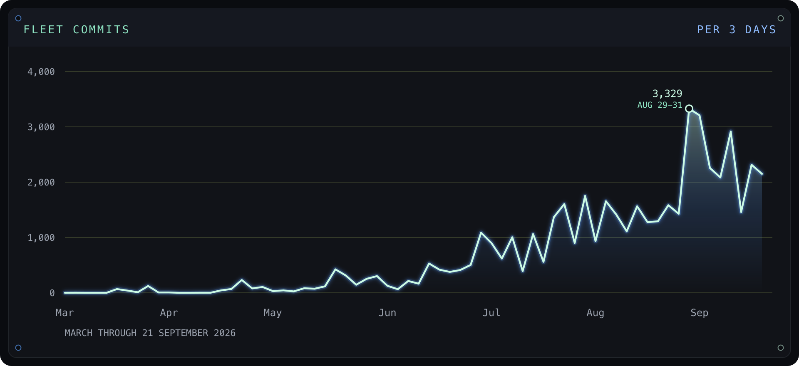

# tokenization.systems

Source for the [tokenization.systems](https://tokenization.systems) static
site by Zach Zukowski. The site publishes research, papers, frameworks,
public-comment letters, and resume profiles on tokenized payments,
stablecoin regulation, governance, and AI infrastructure.

The live site is [tokenization.systems](https://tokenization.systems).

## Fleet commits

Commits per three days, March through 21 September 2026. The series is fleet workload. Peak 3,329 from 29 August to 31 August.



The same chart is on the [agent infrastructure](https://tokenization.systems/agent-infrastructure/) page, under the system scale section.

## What's here

| Path | Purpose |
|---|---|
| `index.html`, `404.html`, `*.html` (root) | Top-level landing pages |
| `papers/` | Per-paper briefing pages with abstracts and SSRN links |
| `research/` | Research index page |
| `frameworks/`, `overview/` | Framework explainers and program overview |
| `resume/`, `resumes/` | Resume profile pages and downloadable PDFs |
| `speaker/`, `speaker-and-advisory/` | Speaker bio and advisory page |
| `letters/` | Federal comment letters submitted to FDIC, OCC, FinCEN, Treasury |
| `contact/` | Contact page |
| `assets/`, `icons/`, `ink-brand-kit/`, `ink-logos/`, `Publication-Images/` | Image and brand assets |
| `script.js`, `styles.css` | Front-end JS and CSS |

## Build

GitHub Pages auto-build via `.github/workflows/build-deploy.yml`:

1. Jekyll build (`bundle exec jekyll build`) using the `github-pages` gem
   pinned in `Gemfile`. Most served pages are static HTML; Jekyll's role
   is to pass them through and stay out of the way.
2. Post-process via `npm run build:postprocess`: PurgeCSS, CleanCSS,
   Terser, html-minifier-terser, and critical-CSS inlining
   (`scripts/inline-critical-css.mjs`).
3. Deploy via `actions/deploy-pages@v4`.

The build only runs on `CryptoZach/CryptoZach` (guarded by an `if:`
condition on both jobs). The custom domain `tokenization.systems` is
configured via `CNAME` and Cloudflare DNS.

## Local development

```bash
# Ruby/Jekyll
bundle install
bundle exec jekyll serve

# Node post-processing tools
npm ci
npm run build:critical-css   # critical-CSS inliner
npm run check:responsive     # responsive-layout checker
npm run build:matrix-icons   # matrix-icons builder
```

## Licensing

- **Site code** (`script.js`, `styles.css`, build tooling, Jekyll config,
  GitHub Actions workflows): MIT, see `LICENSE`.
- **Site content** (research text, paper PDFs, exhibits): CC BY 4.0, see
  `LICENSE-CONTENT.md`. Names, logos, and brand files are not included.

## Citation

For citations to specific papers, see the per-paper SSRN page linked from
the relevant `papers/<paper>/` page on the site.

## Contact

zach@tokenization.systems
